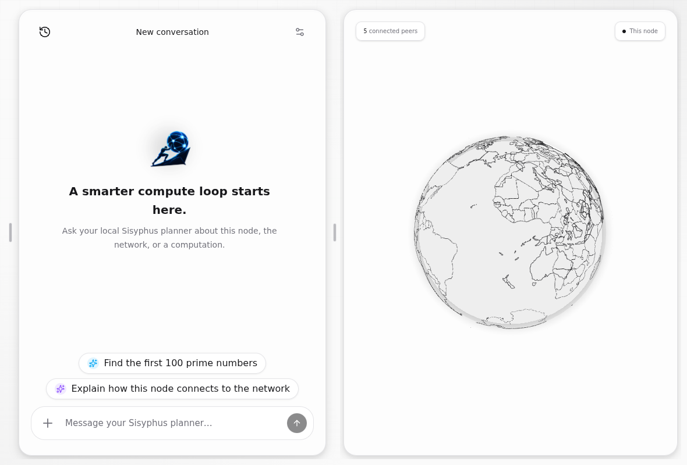
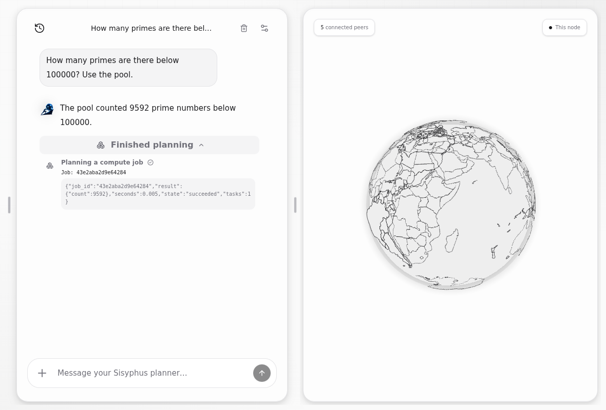
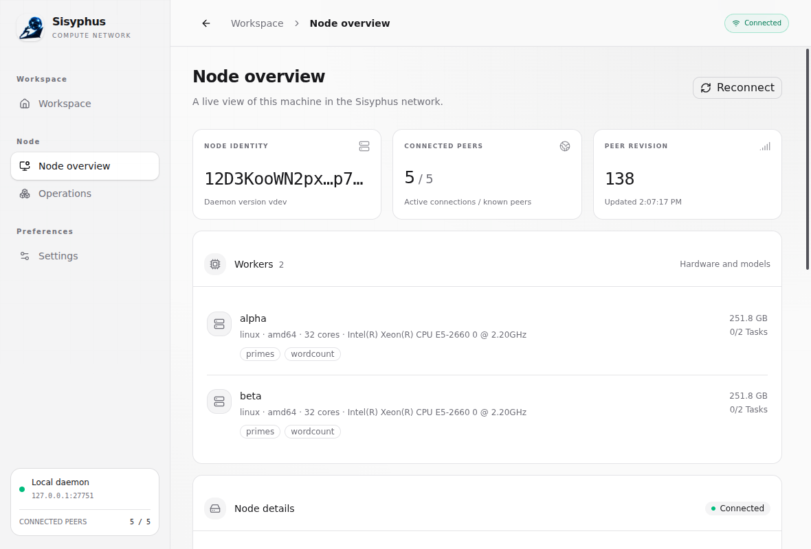
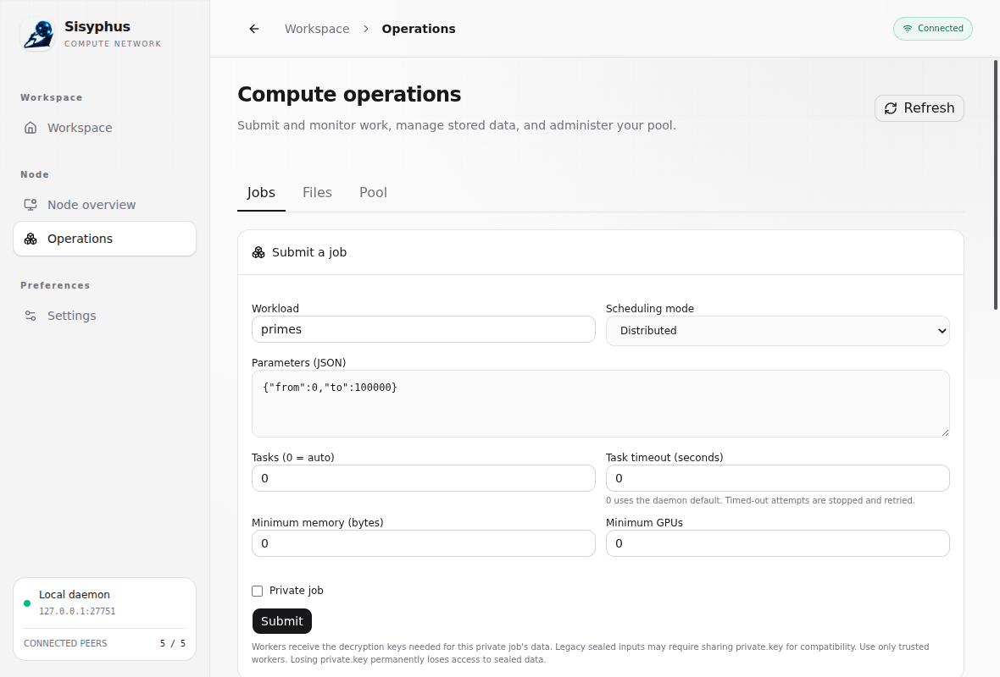
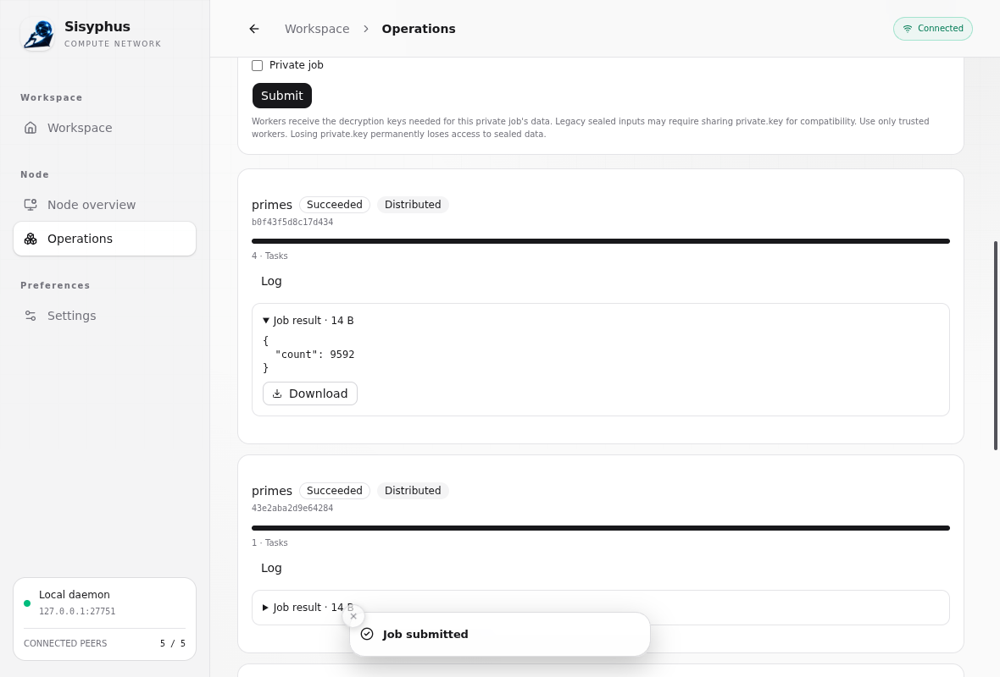
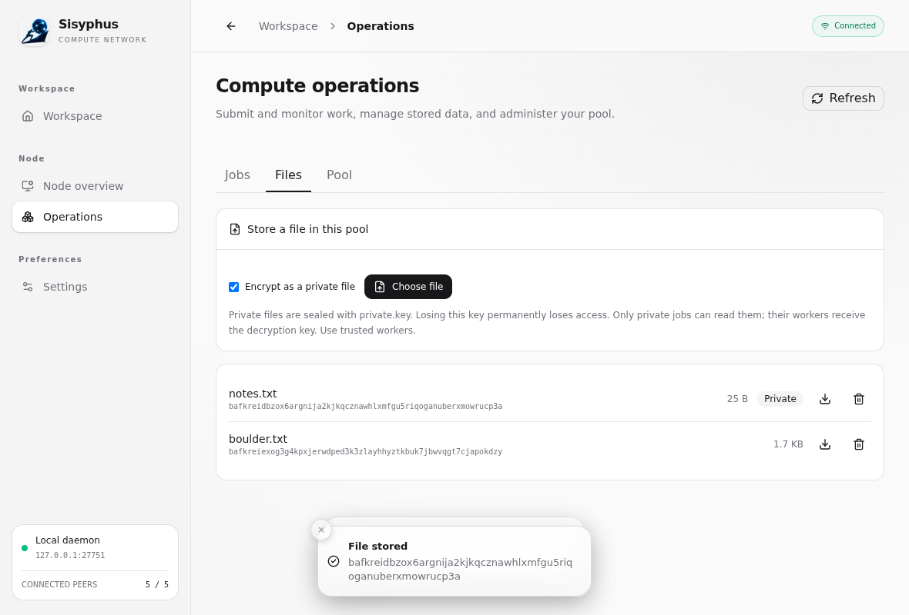
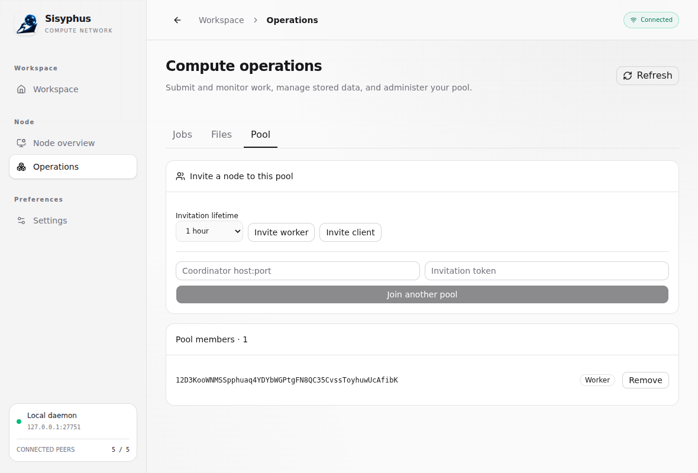
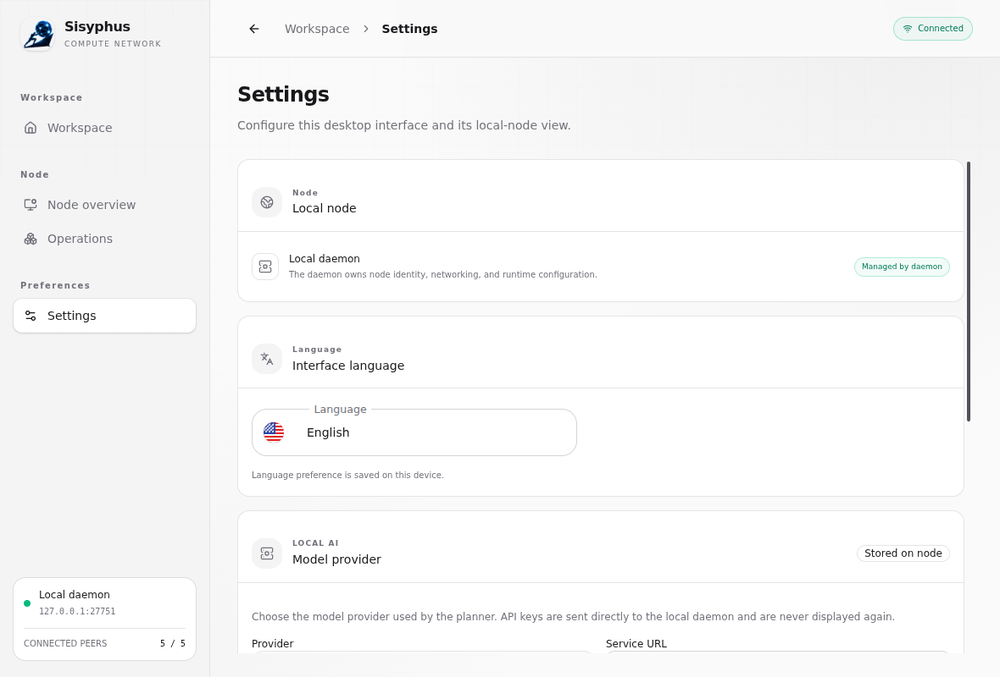

# Using Sisyphus

A walk through Sisyphus as someone using it sees it: start a node, ask it a question, run work on a pool, keep files, and add a second machine. The pictures are of the desktop app; each section ends with the command that does the same from a terminal, because the app and the command line talk to the same node.

The pictures were taken on 10 October 2026 from a development build, against the three-node example backend (`examples/desktop-backend.sh`) planning with a small local model. The app is under active development, so details will have moved.

## What you are looking at

A **node** is one running copy of `sisyphusd`. A **pool** is a group of nodes that work together: one coordinates, and the others, the **workers**, run tasks for it. The **planner** is a language model that a node can ask to turn a question into work for the pool. The desktop app is a window onto one node on your own machine.

Nothing here costs anything or leaves your machines. There is no token and no public network yet; see the [project status](../README.md#project-status).

## Starting

You need the node and, if you want the window, the app.

```sh
make build                                        # builds bin/sisyphusd; needs Go
bin/sisyphusd run --api-listen 127.0.0.1:50051    # a node that is its own coordinator and worker
```

```sh
cd apps/sisyphus
npm install
npm run dev                                       # the desktop app, connected to that node
```

If no node is answering on `127.0.0.1:50051`, the app starts one itself and stops it when you quit. A node it finds already running is used and left alone. Unsigned builds of the app for Linux, Windows and macOS, with the node inside, are attached to each run of the `Desktop packaging` workflow on GitHub; they are development builds, not installers.

For a pool with something in it straight away, `examples/desktop-backend.sh` starts three nodes on one machine and prints how to point the app at them.

## The workspace



The app opens on the workspace. On the left is the conversation with your node's planner. On the right is a globe showing this node and the nodes it knows of, with a count of those it is connected to. The handles between the panes resize them; the clock at the top left opens earlier conversations.

On a narrow window the two become one view with a switch at the bottom. On a machine with no WebGL the globe is left out and the chat takes the room.

## Giving the planner a model

The planner needs a language model before it can answer. Any of these will do:

- a model served by [Ollama](https://ollama.com) on your machine, which costs nothing;
- any service that speaks as OpenAI does, including a local one;
- Claude, with an API key.

Set it in **Settings → Model provider**, or from a terminal:

```sh
bin/sisyphusd model set --model llama3.1:8b       # a model your Ollama already has
```

A small local model works for simple questions and makes mistakes on harder ones; the pool's arithmetic is exact either way, and the steps the planner took are there to check.

## Asking a question



Type a question and press Enter. If answering needs computing, the planner writes a job, the pool runs it, and the planner answers from the result. **Finished planning** opens to show what it did: here, one job, with its ID and the result the pool returned. The answer above it comes from that result, not from the model's memory.

The **+** beside the box attaches a file to the question. An attached file is stored sealed, and the job that reads it is private.

From a terminal:

```sh
bin/sisyphusd ask "How many primes are there below 100000?"
bin/sisyphusd ask --chat <id> "And below a million?"      # carry the conversation on
```

## The node



**Node overview** is the machine's own view of the network: its identity, how many nodes it is connected to, and every worker of its pool with its processor, memory, free task slots and the kinds of work it runs. Further down are the node's addresses and the nodes it has found, each of which you can trust for compute or not. Trusting one admits it to your pool as a worker.

```sh
bin/sisyphusd id
bin/sisyphusd nodes
```

## Running a job yourself



**Operations → Jobs** submits work without the planner. Choose the workload, give its parameters as JSON, and say how the work is to be spread: **Distributed** splits it across the pool's workers. `Tasks` at 0 lets the node decide how many pieces to cut it into.



Jobs appear below the form as they run, newest first, each with its state, its progress, its log and its result.

**Private job** seals what the job reads and writes. Workers are given the keys for that job's data and nothing more. The key itself, `private.key` in the node's data directory, is the only way back to sealed data: if it is lost, so is the data.

```sh
bin/sisyphusd job submit --params '{"from":0,"to":100000}'
bin/sisyphusd job get <job-id>
bin/sisyphusd job logs <job-id>
```

## Files



**Operations → Files** stores files in the pool for jobs to read. Each is named by a content identifier, the long string under its name, which is a fingerprint of its bytes: the same file always has the same one, and a file cannot be swapped for another under it. Tick **Encrypt as a private file** to seal a file before it is stored; only private jobs can read it.

```sh
bin/sisyphusd blob put notes.txt
bin/sisyphusd job submit --workload wordcount --params '{"input":"<cid>"}'

bin/sisyphusd key new job.key                                 # a key of your own, for sealed files
bin/sisyphusd blob put --key-file job.key notes.txt
bin/sisyphusd job submit --workload wordcount --key-file job.key --params '{"input":"<sealed-cid>"}'
```

## Adding another machine



A second machine joins your pool by invitation. **Operations → Pool → Invite worker** prints one; it can be used once, within the time you choose. On the other machine:

```sh
sisyphusd run --role worker --coordinator <your-address>:7700 --join <invitation> --name <a-name>
```

Two things to know:

- **Your node must be listening where the other machine can reach it.** A node the app started for itself listens only on your own machine. Start the node yourself with `--listen 0.0.0.0:7700`, and open TCP port 7700 to the other machine.
- **Invite client** is for a machine that submits work and stores files but runs none.

Members are listed underneath, and **Remove** takes one out. [Testing a pool across machines](multi-machine-test.md) goes through all of it step by step, including what to do when a machine will not join.

```sh
bin/sisyphusd pool invite
bin/sisyphusd pool members
```

## Settings



**Settings** holds what belongs to the window (language, theme and accent, which are kept on this device) and the planner's model, which is kept on the node. The app is in seven languages, two of them written right to left.

## Checking results

A pool of your own machines can be taken at its word. One with other people's machines in it cannot, and a job can ask to be checked:

```sh
bin/sisyphusd job submit --verify 2 --params '{"from":0,"to":100000}'          # two workers must agree
bin/sisyphusd job submit --audit-share 0.2 --params '{"from":0,"to":100000}'   # this node reruns a fifth itself
```

What each of these catches and what it does not is in the [node's README](../apps/sisyphusd/README.md#verifying-results) and the [security model](security-model.md).

## From an AI agent

The node is also an MCP server, so an agent such as Claude Code can use the pool as a tool:

```sh
claude mcp add sisyphus -- sisyphusd mcp
```

The skill in `skills/sisyphus` tells an agent how to use it well. Both are described in the [node's README](../apps/sisyphusd/README.md).

## Where to go next

- [The node's README](../apps/sisyphusd/README.md): every command and option.
- [Testing a pool across machines](multi-machine-test.md): a real pool on real machines.
- [The security model](security-model.md): what is protected, and what is not yet.
- [The desktop app's README](../apps/sisyphus/README.md): building and packaging the app.
